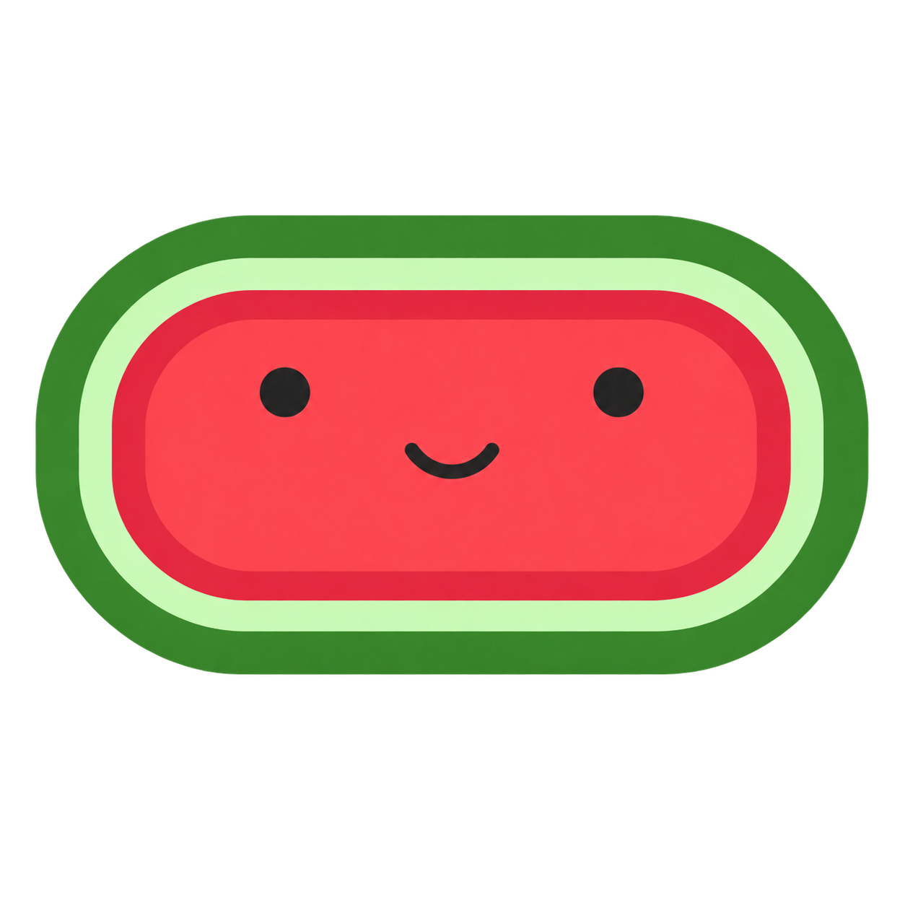

  

<h1 align="center">WideMelon</h1>

  A widescreen solution that gives Nintendo DS games the way they are meant to be played.

  
  

WideMelon lets Nintendo DS games show more of their 3D world on a widescreen
display. The native 2D interface, menus, videos, and touchscreen keep their
normal proportions instead of being stretched.

## Download

Get Windows, macOS, and Linux builds from the
[Releases page](https://github.com/pruefsumme/widemelon/releases).

- Windows: extract the ZIP and open `widemelon.exe`.
- macOS: choose `macos-arm64` for Apple Silicon or `macos-x86_64` for Intel,
  then move `WideMelon.app` to Applications.
- Linux: mark the AppImage executable and open it.

Ad-hoc macOS builds may need a one-time right-click **Open** confirmation.
Development builds are available from the
[Release workflow](https://github.com/pruefsumme/widemelon/actions/workflows/release.yml).

## How to use

1. Open WideMelon.
2. Choose the viewport, window resolution, and render scale.
3. Select **Start melonDS**.
4. Drag a `.nds` file onto the melonDS window, or use **File > Open ROM**.

WideMelon does not include games, ROMs, BIOS, firmware, or save files. Use your
own legally obtained game files.

## What you get

- Wider 3D views from 4:3 through 32:9, with native proportions for 2D layers.
- Render scales from 1× to 8×, fullscreen, and integer scaling.
- The familiar melonDS menus, controls, save states, and drag-and-drop support.
- An optional phone bottom screen and touch controller.
- Separate settings and saves, so a normal melonDS installation is untouched.

## Phone screen and controller

WideMelon can show the physical bottom screen and DS controls on a phone.

1. Open **Phone screen…** beside the resolution selector, or use
   **Config > Phone screen & controller…**.
2. Select the private LAN address shared with the phone.
3. Start the server and scan the displayed QR code.

The phone and computer must be on the same trusted, non-guest network. The
bridge is off by default. Use **Edit controller layout…** to arrange the phone
controls. While connected, the phone provides the bottom screen and the desktop
shows the wide top screen; the desktop bottom screen returns if the phone
disconnects. See [BUILD.md](BUILD.md#phone-screen-and-controller) for firewall
setup and troubleshooting details.

## What to expect

Widescreen support depends on how each game draws its 3D scene. WideMelon can
only reveal useful geometry when the game renders it beyond the original view,
so results vary by game. Some games may gain little or hide objects outside the
original screen area; battles, videos, menus, or special effects can remain
4:3. Expanded views use the classic OpenGL renderer.

## How to build

See [BUILD.md](BUILD.md) for build, test, release, and development instructions.

## Credits

WideMelon is based on [melonDS](https://github.com/melonDS-emu/melonDS) and is
maintained as an independent project. Thanks to the melonDS contributors and to
everyone testing WideMelon and reporting issues.

## Licenses

WideMelon is free software, released under the
[GNU General Public License v3.0 or later](LICENSE).
